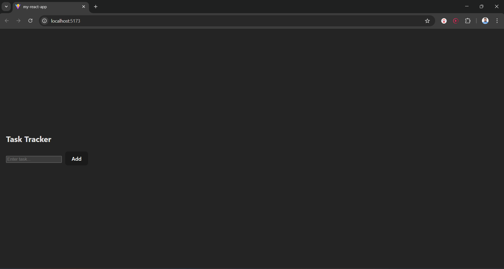

# Task Tracker (React + Vite)

A simple Task Tracker application built using **React** and **Vite**.

## Features

- Add new tasks
- Display tasks in a list
- Delete tasks
- Press **Enter** to add tasks
- Tasks persist using **LocalStorage**
- Filter tasks by:
  - **All**
  - **Done**
  - **Pending**
- Add tasks using **Enter key**
- Tasks persist using **LocalStorage** (data remains after refresh)

## Tech Stack

- React
- Vite
- JavaScript
- HTML/CSS

## Project Setup

### 1. Clone the repository

```bash
git clone https://github.com/SandeshRKarande/task-tracker-react.git
```

## Screenshot


